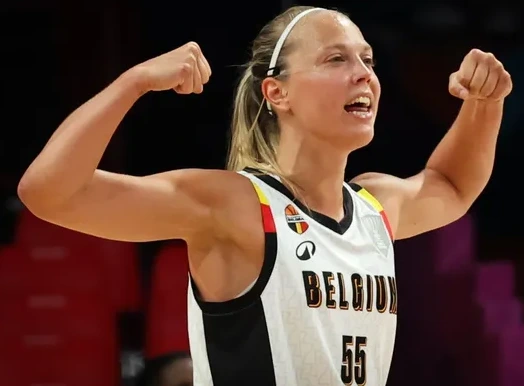

# Julie Allemand

# Informations Générales
- **Date de naissance** :  
- **Nationalité** :  Belge
- **Sport / Discipline** : Basket-Ball 
- **Poste / Spécialité** (si applicable) :  
- **Équipe(s) / Club(s)** :  
- **Période d’activité** :  

# Palmarès et Distinctions
| Année | Compétition               | Résultat  | Remarque |
| ----- | ------------------------- | --------- | -------- |
| 2023  | [[Euro de Basket]] - 2023 | Vainqueur |          |
| 2025  | [[Euro de Basket]] - 2025 | Finaliste |          |

# Style et Caractéristiques
Décrire le style de jeu, les points forts/faibles, les particularités.

# Records et Faits Marquants
- 21 points marqués, aucun tir raté, 4 assists, 5 interceptions. Record [[WNBA]] en septembre 2025

# Controverses ou Événements Importants
Évoquer les polémiques ou moments clés de sa carrière.

# Retraite et Reconversion
Expliquer ce que le sportif fait après sa carrière (entraîneur, consultant, etc.).

# Sources et Références
- https://www.rtbf.be/article/julie-allemand-encensee-par-sa-coach-impossible-de-la-sortir-du-terrain-elle-est-tellement-intelligente-11588170
- 
